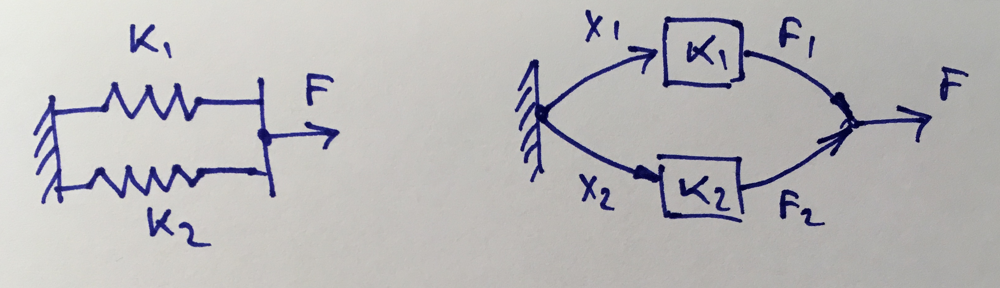

#Apendix A
## Series and parallel springs

This part is devoted to a method to efficient calculating of Equivalent spring for Series and parallel connection of springs. We're pretty sure that this method is being used for a long time beneath a lot of CAE program. We've decided to add this methos to show the power of Linear Algebra.
In mechanics, two or more springs are said to be in series when they are connected end-to-end or point to point, and in parallel when they are connected side-by-side; in both cases, so as to act as a single spring.
Any combination of Hookean (linear-response) springs in series or parallel behaves like a single Hookean spring. The formulas for combining their physical attributes are analogous to those that apply to capacitors connected in series or parallel in an electrical circuit.
Well known formulae to calculate Equivalent spring could be found at:
 * https://en.wikipedia.org/wiki/Series_and_parallel_springs
 * Garrett, p.75

### Parallel connection

The equations describing this system are following:
$${\begin{cases}
F=F_1+F_2\\
F_1=k_1x_1\\
F_2=k_2x_2\\
x_1=x_2
\end{cases}}
$$
Let's assume that $x_1=1$, than $k=F/x_1=F$ and rewrite the system at this way:
$${\begin{cases}
F=k_1x_1+k_2x_2\\
x_1=x_2\\
x_1=1
\end{cases}}
\equiv
{\begin{cases}
x_1=1\\
x_1-x_2=0\\
k_1x_1+k_2x_2-F=0
\end{cases}}
$$
Let's denote
$$
[A]=\left[
    \begin{matrix}
    1 & 0 & 0 \\
    1 & -1 & 0 \\
    k_1 & k_2 & -1 \\
    \end{matrix}\right]\text{, }
    \{y\}=\left\{
    \begin{matrix}
    x_1 \\
    x_2 \\
    F \\
    \end{matrix}\right\}\text{, }
	\{b\}=\left\{
    \begin{matrix}
    1 \\
    0 \\
    0 \\
    \end{matrix}\right\}
    \Rightarrow\\
    [A]\{y\}=\{b\}
$$
Due to $det(A)\ne0$ (why?) $\Rightarrow {y}=[A]^{-1}\{b\}=(1,1,k_1+k_2)^\intercal \Rightarrow k=k_1+k_2$

### Series connection

The equations describing this system are following:
$${\begin{cases}
F=k_1x_1\\
F=k_2x_2\\
F=1
\end{cases}}
$$
Let's assume that $F=1$, than $k=F/x=1/(x_1+x_2)$ and rewrite the system at this way:

$${\begin{cases}
k_1x_1-F=0\\
k_2x_2-F=0\\
F=1
\end{cases}}
$$

Let's denote
$$
[A]=\left[
    \begin{matrix}
    k_1 & 0 & -1 \\
    0 & k_2 & -1 \\
    0 & 0 & 1 \\
    \end{matrix}\right]\text{, }
    \{y\}=\left\{
    \begin{matrix}
    x_1 \\
    x_2 \\
    F \\
    \end{matrix}\right\}\text{, }
	\{b\}=\left\{
    \begin{matrix}
    0 \\
    0 \\
    1 \\
    \end{matrix}\right\}
    \Rightarrow\\
    [A]\{y\}=\{b\}
$$

Due to $det(A)\ne0$ $\Rightarrow {y}=[A]^{-1}\{b\}=(1/k_1,1/k_2,1)^\intercal \Rightarrow k=(\frac{1}{k_1}+\frac{1}{k_2})^{-1}$

