### 4. Verification of Type 0 by Examples

We verify the main result of Section 3 using the examples collected in Appendix B (systems of Type 0). To demonstrate the method, we have developed a set of Python scripts that perform the necessary calculations and generate the corresponding plots. All scripts are available at:

[https://github.com/stdapproach/sciArticle/tree/develop/ODE_Delta/raw](https://github.com/stdapproach/sciArticle/tree/develop/ODE_Delta/raw)

#### 4.1 Example 1 [Oliveira and Cortes, p. 3], [Schiff, p. 82]

Consider the second‑order ODE (Type 0a)
$
\begin{cases}
y'' + a y' = \delta(t), \\[2pt]
y(0) = y'(0) = 0
\end{cases}
\;\Longrightarrow\;
\operatorname{IVP}(\{1, a, 0\}, \delta(t), t_0=0, \mathbf{y}_0=\{0,0\}).$
From (3.1),
$
A = \begin{bmatrix}
1 & 0 \\
a & 1
\end{bmatrix},\quad
\mathbf{d} = \begin{bmatrix} 0 \\ 1 \end{bmatrix}
\;\Longrightarrow\;
A^{-1} = \begin{bmatrix}
1 & 0 \\
-a & 1
\end{bmatrix},\quad
A^{-1}\mathbf{d} = \begin{bmatrix} 0 \\ 1 \end{bmatrix}.
$

Applying (3.2)–(3.3), the following two systems are equivalent:

$
\begin{cases}
y'' + a y' = \delta(t), \\
y(0) = y'(0) = 0
\end{cases}
\;\equiv\;
\begin{cases}
y'' + a y' = 0, \\
y(0) = 0,\; y'(0) = 1
\end{cases}.
$

In compact notation,
$
\operatorname{IVP}(\{1, a, 0\}, \delta(t), t_0=0, \mathbf{y}_0=\{0,0\})
\;\equiv\;
\operatorname{IVP}(\{1, a, 0\}, 0, t_0=0, \mathbf{y}_0=\{0,1\}).
$

For $a = 2$, we compare the numerical solution of the homogeneous system with modified initial conditions against the analytical solution of the original problem.

**Analytical solution** (from Appendix B):
$
y(t) = \frac{1}{a}\bigl(1 - e^{-a t}\bigr).
$

The numerical solution, analytical solution, and error (from `example1.py`) are shown below:

#### 4.1 Example 1

  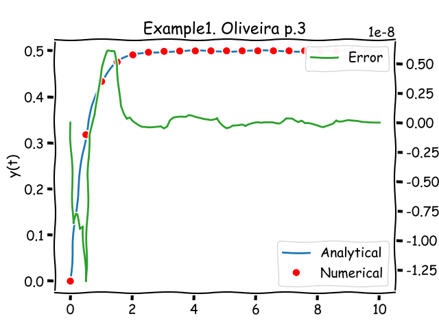
  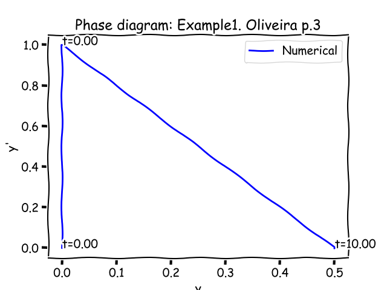

#### 4.2 Example 2 [Finan, pp. 57–58]

Consider the second‑order ODE (Type 0a)
$
\begin{cases}
2y'' + 4y' + 10y = \delta(t) \\[2pt]
y(0) = 0,\; y'(0) = 0
\end{cases}
\;\Longrightarrow\;
\operatorname{IVP}(\{2,4,10\}, \delta(t), t_0=0, \mathbf{y}_0=\{0,0\}).
$
Then
$
A = \begin{bmatrix}
2 & 0 \\
4 & 2
\end{bmatrix},\quad
\mathbf{d} = \begin{bmatrix} 0 \\ 1 \end{bmatrix}
\;\Longrightarrow\;
A^{-1} = \begin{bmatrix}
1/2 & 0 \\
-1   & 1/2
\end{bmatrix},\quad
A^{-1}\mathbf{d} = \begin{bmatrix} 0 \\ 1/2 \end{bmatrix}.
$
Hence
$
\mathbf{z}_0 = \mathbf{y}_0 + A^{-1}\mathbf{d} = \begin{bmatrix} 0 \\ 1/2 \end{bmatrix}.
$
The equivalent homogeneous system is therefore
$
\begin{cases}
2z'' + 4z' + 10z = 0 \\[2pt]
z(0) = 0,\; z'(0) = 1/2
\end{cases}.
$

**Analytical solution**:
$
y(t) = \frac{1}{4} e^{-t} \sin(2t).
$
Results from `example2.py`:

  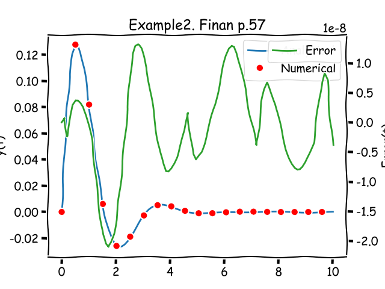
  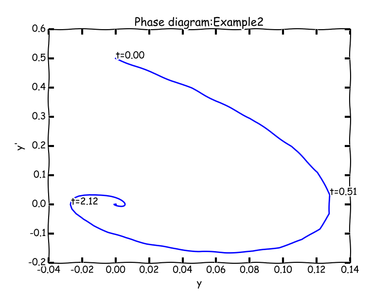

#### 4.3 Example 3 [Nagy, p. 189]

Consider the second‑order ODE (Type 0a)
$
\begin{cases}
y'' + 2y' + 2y = \delta(t) \\[2pt]
y(0) = 0,\; y'(0) = 0
\end{cases}
\;\Longrightarrow\;
\operatorname{IVP}(\{1,2,2\}, \delta(t), t_0=0, \mathbf{y}_0=\{0,0\}).
$
Here
$
A = \begin{bmatrix}
1 & 0 \\
2 & 1
\end{bmatrix},\quad
\mathbf{d} = \begin{bmatrix} 0 \\ 1 \end{bmatrix}
\;\Longrightarrow\;
A^{-1} = \begin{bmatrix}
1 & 0 \\
-2 & 1
\end{bmatrix},\quad
A^{-1}\mathbf{d} = \begin{bmatrix} 0 \\ 1 \end{bmatrix}.
$
Thus
$
\mathbf{z}_0 = \mathbf{y}_0 + A^{-1}\mathbf{d} = \begin{bmatrix} 0 \\ 1 \end{bmatrix}.
$
The equivalent homogeneous system is
$
\begin{cases}
z'' + 2z' + 2z = 0 \\[2pt]
z(0) = 0,\; z'(0) = 1
\end{cases}.
$

**Analytical solution**:
$
y(t) = e^{-t} \sin(t).
$
Results from `example3.py`:

  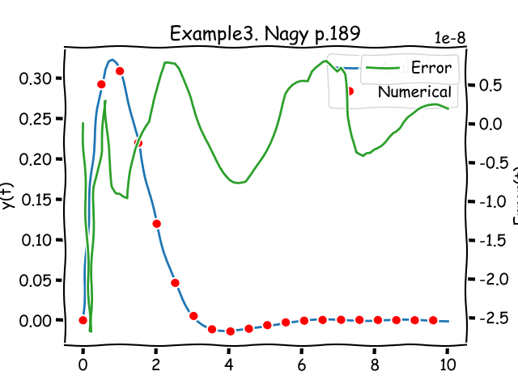
  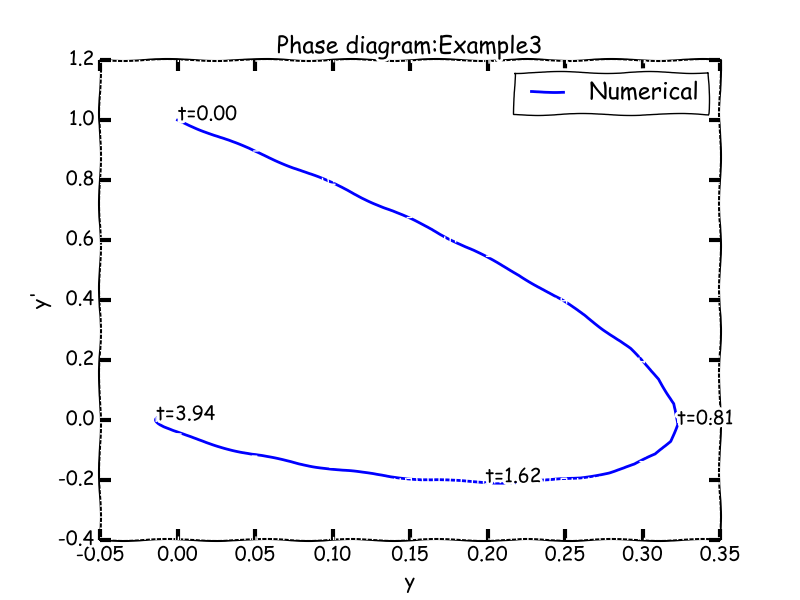

#### 4.4 Example 4 [Nagy, p. 189]

Consider the second‑order ODE with a time‑delayed impulse (Type 0b):
$
\begin{cases}
y'' + 2y' + 2y = \delta(t - c), \\[2pt]
y(0) = y'(0) = 0, \\[2pt]
c = 2.
\end{cases}
$
The solution strategy splits the problem into two stages:

1. On $0 \le t \le c$, the system is homogeneous with zero initial conditions:
   $$
   \begin{cases}
   y_1'' + 2y_1' + 2y_1 = 0, \\[2pt]
   y_1(0) = 0,\; y_1'(0) = 0.
   \end{cases}
   $$
   The solution is $y_1(t) \equiv 0$.

2. For $t \ge c$, we solve the same system with the impulse, using the final values from the first stage as initial conditions:
   $$
   \begin{cases}
   y_2'' + 2y_2' + 2y_2 = \delta(t - c), \\[2pt]
   y_2(c) = y_1(c),\; y_2'(c) = y_1'(c).
   \end{cases}
   $$

The overall solution is
$
y(t) =
\begin{cases}
y_1(t), & 0 \le t \le c, \\[2pt]
y_2(t), & t \ge c.
\end{cases}
$

**Analytical solution**:
$
y(t) = H(t - c)\, e^{-(t-c)} \sin(t - c).
$
Results from `example4.py`:

  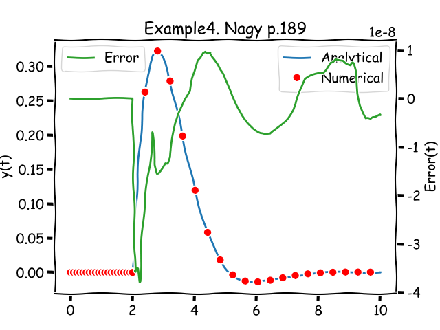
  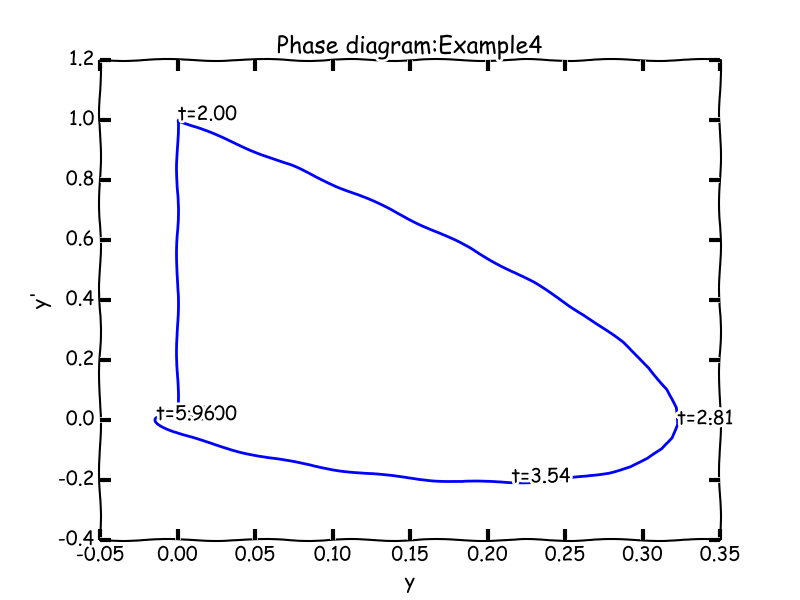

#### 4.5 Example 5 [Chasnov, p. 65]

Consider the second‑order ODE (Type 0b)
$
\begin{cases}
2y'' + y' + 2y = \delta(t - c), \\[2pt]
y(0) = y'(0) = 0, \\[2pt]
c = 2.
\end{cases}
$
Following the same splitting procedure:

- On $0 \le t \le c$:
  $$
  \begin{cases}
  2y_1'' + y_1' + 2y_1 = 0, \\[2pt]
  y_1(0) = 0,\; y_1'(0) = 0,
  \end{cases}
  $$
  giving $y_1(t) \equiv 0$.

- On $t \ge c$:
  $$
  \begin{cases}
  2y_2'' + y_2' + 2y_2 = \delta(t - c), \\[2pt]
  y_2(c) = y_1(c),\; y_2'(c) = y_1'(c).
  \end{cases}
  $$

**Analytical solution**:
$
y(t) = \frac{2}{\sqrt{15}}\, H(t - c)\, e^{-(t-c)/4} \sin\!\left(\frac{\sqrt{15}}{4}(t - c)\right).
$
Results from `example5.py`:

  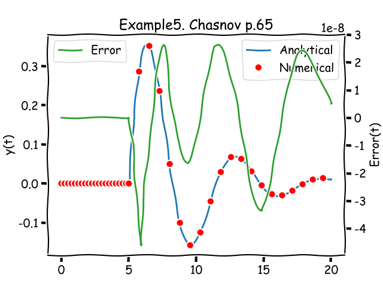
  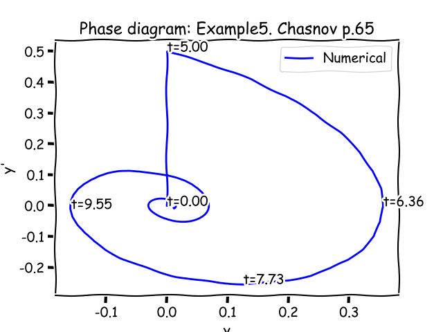

#### 4.6 Example 6 [Zill, p. 293]

Consider the second‑order ODE (Type 0b)
$
\begin{cases}
y'' + y = 4\delta(t - 2\pi), \\[2pt]
y(0) = 0,\; y'(0) = 0.
\end{cases}
$

Splitting yields:

- On $0 \le t \le 2\pi$: $y_1'' + y_1 = 0$, $y_1(0)=0$, $y_1'(0)=0$ → $y_1(t) \equiv 0$.
- On $t \ge 2\pi$: $y_2'' + y_2 = 4\delta(t - 2\pi)$, with $y_2(2\pi)=0$, $y_2'(2\pi)=0$.

**Analytical solution**:
$
y(t) = 4 H(t - 2\pi) \sin(t).
$
Results from `example6.py`:

  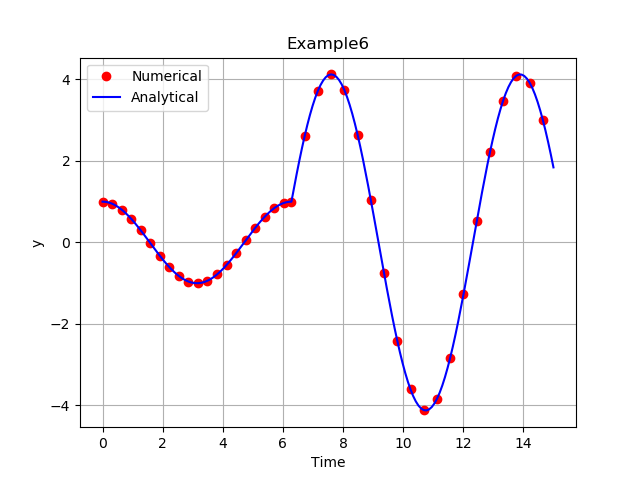
  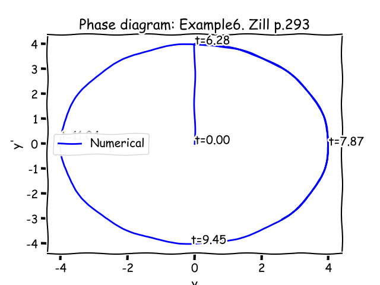

#### 4.7 Example 7 [Zill, p. 293]

Consider the same system but with non‑zero initial conditions (Type 0b):
$
\begin{cases}
y'' + y = 4\delta(t - 2\pi), \\[2pt]
y(0) = 1,\; y'(0) = 0.
\end{cases}
$

Splitting:

- On $0 \le t \le 2\pi$: $y_1'' + y_1 = 0$, $y_1(0)=1$, $y_1'(0)=0$ → $y_1(t) = \cos t$.
- On $t \ge 2\pi$: $y_2'' + y_2 = 4\delta(t - 2\pi)$, with $y_2(2\pi) = \cos(2\pi)=1$, $y_2'(2\pi) = -\sin(2\pi)=0$.

**Analytical solution**:
$y(t) = \cos t + 4 H(t - 2\pi) \sin t.$

Results from `example7.py`:

  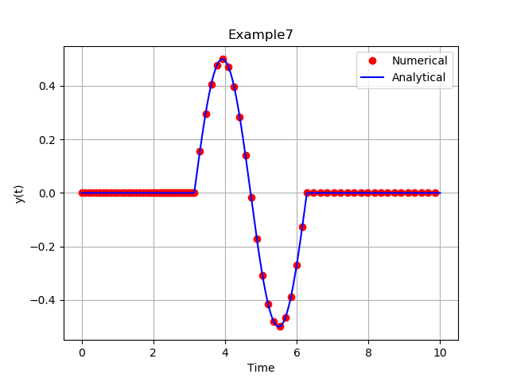
  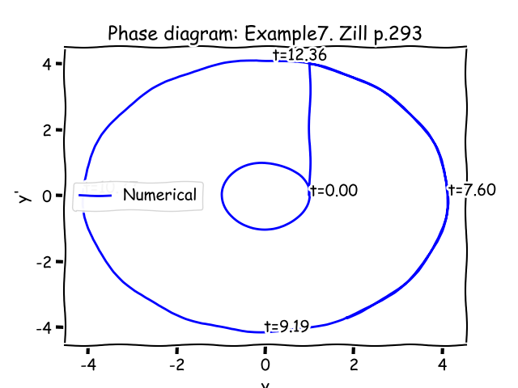

#### 4.8 Example 8 [Nagy, p. 190]

Consider a system with two impulses (Type 0c):
$
\begin{cases}
y'' + 4y = \delta(t - \pi) - \delta(t - 2\pi), \\[2pt]
y(0) = y'(0) = 0.
\end{cases}
$

The solution follows the same principle as for Type 0b: the time axis is divided into intervals $[0,\pi]$, $[\pi,2\pi]$, and $[2\pi,\infty)$. The initial conditions for each subsequent interval are taken from the final values of the preceding interval.

**Analytical solution**:
$
y(t) = \frac{1}{2}\bigl[H(t - \pi) - H(t - 2\pi)\bigr] \sin(2t).
$
Results from `example8.py`:

  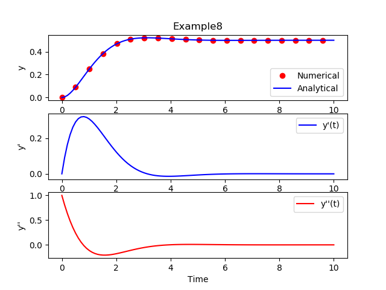
  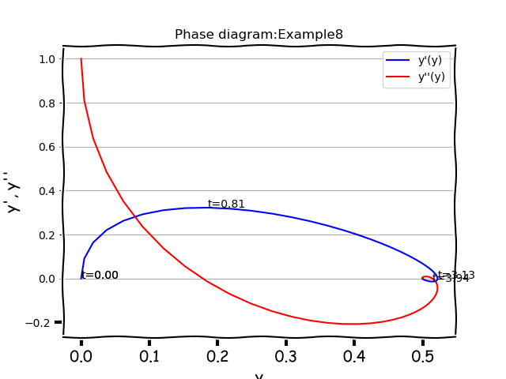

> **Remark:** This example illustrates that an impulsive load can both excite and suppress vibration.

#### 4.9 Example 9 (Third‑order system, Type 0a)

Consider the third‑order ODE
$
\begin{cases}
y''' + 2y'' + 2y' = \delta(t), \\[2pt]
y(0) = 0,\; y'(0) = 0,\; y''(0) = 0
\end{cases}
\;\Longrightarrow\;
\operatorname{IVP}(\{1,2,2,0\}, \delta(t), t_0=0, \mathbf{y}_0=\{0,0,0\}).
$
Here
$
A = \begin{bmatrix}
1 & 0 & 0 \\
2 & 1 & 0 \\
2 & 2 & 1
\end{bmatrix},\quad
\mathbf{d} = \begin{bmatrix} 0 \\ 0 \\ 1 \end{bmatrix}
\;\Longrightarrow\;
A^{-1} = \begin{bmatrix}
 1 & 0 & 0 \\
-2 & 1 & 0 \\
 2 & -2 & 1
\end{bmatrix},\quad
A^{-1}\mathbf{d} = \begin{bmatrix} 0 \\ 0 \\ 1 \end{bmatrix}.
$
Thus
$
\mathbf{z}_0 = \mathbf{y}_0 + A^{-1}\mathbf{d} = \begin{bmatrix} 0 \\ 0 \\ 1 \end{bmatrix}.
$
The equivalent homogeneous system is
$
\begin{cases}
y''' + 2y'' + 2y' = 0 \\[2pt]
y(0)=0,\; y'(0)=0,\; y''(0)=1
\end{cases}.
$

**Analytical solution**:
$
y(t) = \frac{1}{2} - \frac{1}{2} e^{-t}\bigl(\sin t + \cos t\bigr).
$
Results from `example9.py`:

  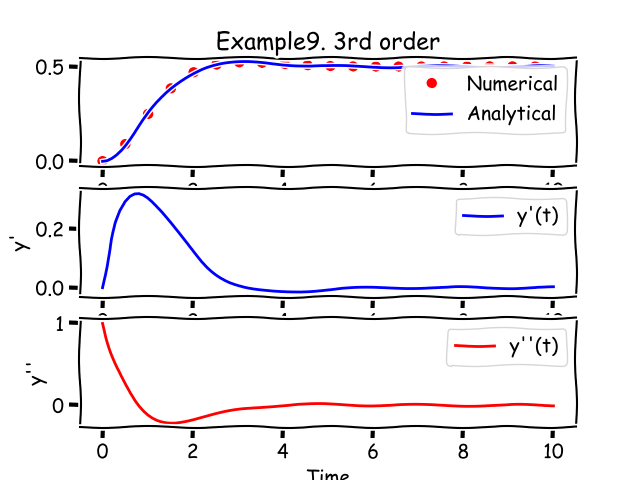
  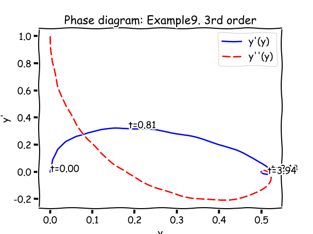

#### 4.10 Additional examples

The following examples (from the literature) can be handled by the same method; we list them without detailed exposition:

- **Example 10.1** [Asadi, p. 62] – second‑order system.
- **Example 10.2** [Adkins, p. 435] – second‑order system.
