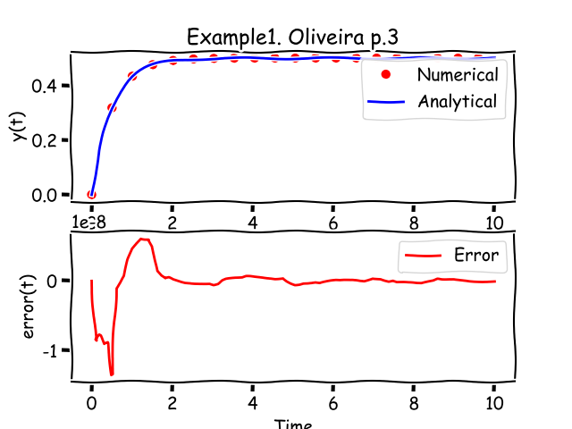
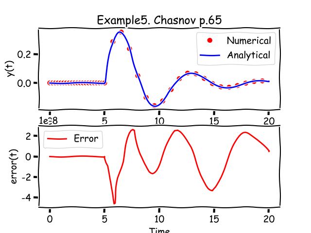
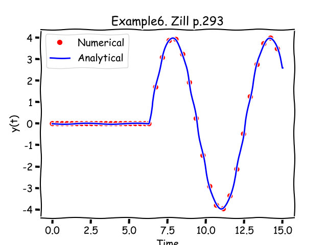
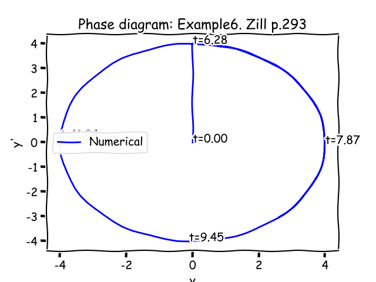
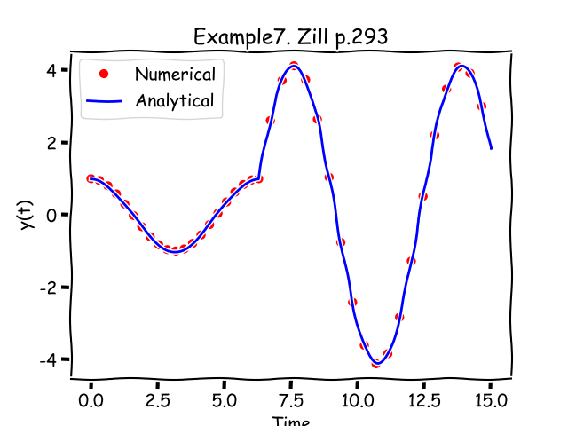
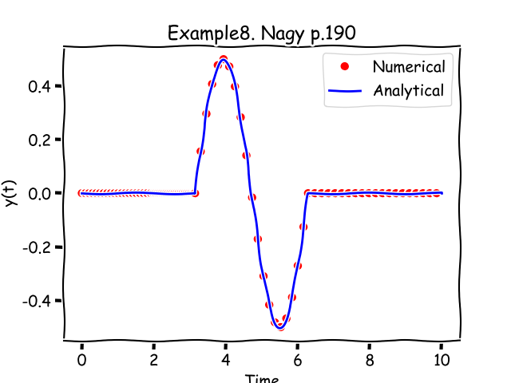
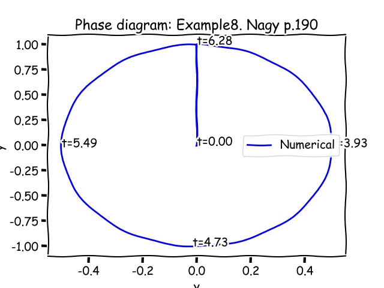

###4. Verification by examples for Type 0
Let's check the main result from previous chapter on examples Appendix B from (system Type0). To prove the method we've created number Python scripts performing the calculation and generating the charts with results. All scripts could be found at https://github.com/stdapproach/sciArticle/tree/develop/ODE_Delta/raw .
#####4.1 Example1 [Oliveira and Cortes, p.3], [Schiff, p.82]
Consider the following first order ODE (Type 0a)
$$
\begin{cases}
y''+ay'=\delta(t),\\
y(0)=y'(0)=0
\end{cases}
\Rightarrow 
IVP(\{1\text{ }a\text{ }0\}, \delta(t), t_0=0,y_0=\{0\text{, }0\})
\Rightarrow\\
$$
according to (3.1)
$$
A=\left[
    \begin{matrix}
    1 & 0 \\
    a & 1 \\
    \end{matrix}\right]\text{, }
\{d\}=\left\{
    \begin{matrix}
    0 \\
    1 \\
    \end{matrix}\right\}\Rightarrow\\
A^{-1}=\left[
    \begin{matrix}
    1 & 0 \\
    -a & 1 \\
    \end{matrix}\right]\text{, }
A^{-1}\{d\}=\left\{
    \begin{matrix}
    0 \\
    1 \\
    \end{matrix}\right\}
$$

According (3.2) and (3.3) these two following system are equal by solution
$$
\begin{cases}
y''+ay'=\delta(t),\\
y(0)=y'(0)=0
\end{cases}
\equiv
\begin{cases}
y''+ay'=0,\\
y(0)=0\\y'(0)=1
\end{cases}
$$
In short form:
$$
IVP(\{1\text{ }a\text{ }0\}, \delta(t), t_0=0,y_0=\{0\text{, }0\})
\equiv 
IVP(\{1\text{ }a\text{ }0\}, 0, t_0=0,y_0=\{0\text{, }1\})
$$

Let's check how to correspond the numerical solution for a=2 for homogenous sytem with non-null IC with analitical solution for the system

Analitycal solution taken from Appendix B:
$$
y(t)=\frac{1}{a}(1-e^{-at})
$$
Numerical solution, analytical solutions and error provided by Python's script (example1.py):

#####4.2 Example2 [Finan, pp.57-58]
Considering the following second order ODE (Type 0a)
$${\begin{cases}
2y''+4y'+10y=\delta(t)\\
y_0=y(0)=0\\
y_1=y'(0)=0
\end{cases}}\Rightarrow
IVP(\{2\text{, }4\text{, }10\}, \delta(t), t_0=0,y_0=\{0\text{, }0\})\Rightarrow\\
A=\left[
    \begin{matrix}
    2 & 0 \\
    4 & 2 \\
    \end{matrix}\right]\text{, }
\{d\}=\left\{
    \begin{matrix}
    0 \\
    1 \\
    \end{matrix}\right\}\Rightarrow\\
A^{-1}=\left[
    \begin{matrix}
    1/2 & 0 \\
    -1 & 1/2 \\
    \end{matrix}\right]\text{, }
A^{-1}\{d\}=\left\{
    \begin{matrix}
    0 \\
    1/2 \\
    \end{matrix}\right\}
\Rightarrow\\
\{z\}_0=\{y\}_0+[A]^{-1}\{d\}=\left\{
    \begin{matrix}
    0 \\
    1/2 \\
    \end{matrix}\right\}$$
These two following system are equal by solution
$${\begin{cases}
2y''+4y'+10y=\delta(t)\\
y_0=y(0)=0\\
y_1=y'(0)=0
\end{cases}}\equiv{\begin{cases}
2z''+4z'+10z=0\\
z_0=z(0)=0\\
z_1=z'(0)=1/2
\end{cases}}
$$
In short form:
$$
IVP(\{2\text{, }4\text{, }10\}, \delta(t), t_0=0,y_0=\{0\text{, }0\})\equiv 
IVP(\{2\text{, }4\text{, }10\}, 0, t_0=0,y_0=\{0\text{, }1/2\})
$$
Analitycal solution:
$$y(t)=\frac{1}{4}e^{-t}sin(2t)$$
Numerical solution, analytical solutions and error provided by Python's script (example2.py):

#####4.3 Example3 [Nagy, p.189]
Considering the following second order ODE (Type 0a)
$${\begin{cases}
y''+2y'+2y=\delta(t)\\
y_0=y(0)=0\\
y_1=y'(0)=0
\end{cases}}\Rightarrow
IVP(\{1\text{, }2\text{, }2\}, \delta(t), t_0=0,y_0=\{0\text{, }0\})\Rightarrow\\
A=\left[
    \begin{matrix}
    1 & 0 \\
    2 & 1 \\
    \end{matrix}\right]\text{, }
\{d\}=\left\{
    \begin{matrix}
    0 \\
    1 \\
    \end{matrix}\right\}\Rightarrow\\
A^{-1}=\left[
    \begin{matrix}
    1 & 0 \\
    -2 & 1 \\
    \end{matrix}\right]\text{, }
A^{-1}\{d\}=\left\{
    \begin{matrix}
    0 \\
    1\\
    \end{matrix}\right\}
\Rightarrow\\
\{z\}_0=\{y\}_0+[A]^{-1}\{d\}=\left\{
    \begin{matrix}
    0 \\
    1 \\
    \end{matrix}\right\}$$
These 2 folloing system are equal by solution:
$$
{\begin{cases}
y''+2y'+2y=\delta(t)\\
y_0=y(0)=0\\
y_1=y'(0)=0
\end{cases}}\Rightarrow
{\begin{cases}
z''+2z'+2z=\delta(t)\\
z_0=z(0)=0\\
z_1=z'(0)=1
\end{cases}}
$$
In short form:
$$
IVP(\{1\text{, }2\text{, }2\}, \delta(t), t_0=0,y_0=\{0\text{, }0\})\equiv 
IVP(\{1\text{, }2\text{, }2\}, 0, t_0=0,y_0=\{0\text{, }1\})
$$
Analitycal solution:
$$y(t)=e^{-t}sin(t)$$
Numerical solution, analytical solutions and error provided by Python's script (example3.py):

#####4.4 Example4 [Nagy, p.189]
Considering the following second order ODE (Type 0b)
$$
\begin{cases}
y''+2y'+2y=\delta(t-c)\\
y(0)=y'(0)=0\\
c=2
\end{cases}
$$
This system could be separated on two systems and the IC for a second system based on results first one:
$$
\begin{cases}
y_1''+2y_1'+2y_1=0\\
y_1(0)=0\\
y_1'(0)=0\\
0\le t \le c
\end{cases}
$$
$$
\begin{cases}
y_2''+2y_2'+2y_2=\delta(t-c)\\
y_2(c)=y_1(c)\\
y_2'(c)=y_1'(c)\\
t \ge c
\end{cases}
$$
So, the solution of the original system is:
$$
y(t) =
\begin{cases}
y_1(t),  & \text{if $0\le t \le c$} \\
y_2(t), & \text{if $t \ge c$}
\end{cases}
$$
Analitycal solution:
$$y(t)=H(t-c)e^{-(t-c)}sin(t-c)$$

Numerical solution and analytical solutions provided by Python's script (example4.py):

#####4.5 Example5 [Chasnov, p.65]
Considering the following second order ODE (Type 0b)
$$
\begin{cases}
2y''+y'+2y=\delta(t-c)\\
y(0)=y'(0)=0\\
c=2
\end{cases}
$$
This system could be separated on two systems and the IC for a second system based on results first one:
$$
\begin{cases}
2y_1''+y_1'+2y_1=0\\
y_1(0)=0\\
y_1'(0)=0\\
0\le t \le c
\end{cases}
$$
$$
\begin{cases}
2y_2''+y_2'+2y_2=\delta(t-c)\\
y_2(c)=y_1(c)\\
y_2'(c)=y_1'(c)\\
t \ge c
\end{cases}
$$
So, the solution of the original system is:
$$
y(t) =
\begin{cases}
y_1(t),  & \text{if $0\le t \le c$} \\
y_2(t), & \text{if $t \ge c$}
\end{cases}
$$
Analitycal solution:
$$
y(t)=\frac{2}{\sqrt{15}}H(t-5)e^{-(t-5)/4}sin(\sqrt{15}(t-5)/4)
$$

Numerical solution and analytical solutions provided by Python's script (example5.py):

#####4.6 Example6 [Zill, p.293]
Considering the following second order ODE (Type 0b)
$$
\begin{cases}
y''+y=4\delta(t-2\pi),\\
y_0=y(0)=0\\
y_1=y'(0)=0
\end{cases}
$$
This system could be separated on two systems, and the IC for a second system based on results first one:
$$
\begin{cases}
y_1''+y_1=0,\\
y_1(0)=0\\
y_1'(0)=0\\
0\le t \le 2\pi
\end{cases}
$$
$$
\begin{cases}
y_2''+y2=4\delta(t-2\pi),\\
y_2(2\pi)=y_1(2\pi)\\
y_2'(2\pi)=y_1'(2\pi)\\
t \ge 2\pi
\end{cases}
$$
Analitycal solution:
$$
y(t)=H(t-2\pi)4sin(t)
$$
Numerical solution and analytical solutions provided by Python's script (example6.py):

#####4.7 Example7 [Zill, p.293]
Considering the following second order ODE (Type 0b)
$$
\begin{cases}
y''+y=4\delta(t-2\pi),\\
y_0=y(0)=1\\
y_1=y'(0)=0
\end{cases}
$$
This system could be separated on two systems, moreover the IC for a second system based on results first one:
$$
\begin{cases}
y_1''+y_1=0,\\
y_1(0)=1\\
y_1'(0)=0\\
0\le t \le 2\pi
\end{cases}
$$
$$
\begin{cases}
y_2''+y_2=4\delta(t-2\pi),\\
y_2(2\pi)=y_1(2\pi)\\
y_2'(2\pi)=y_1'(2\pi)\\
t \ge 2\pi
\end{cases}
$$
Analitycal solution:
$$
y(t)=cos(t)+4H(t,2\pi)sin(t)
$$
Numerical solution and analytical solutions provided by Python's script (example7.py):

#####4.8 Example8 [Nagy, p.190]
Considering the following second order ODE (Type 0c)
$$\begin{cases}
y''+4y=\delta(t-\pi)-\delta(t-2\pi),\\
y(0)=y'(0)=0
\end{cases}$$
To solve this type of system we recommend to use the same approach as used for Type 0b (see 4.4). I.e. separate the orginal system on time line to some number similar system. And the IC for the next system should be taken from previous one.
Analitycal solution:
$$y(t)=\frac{1}{2}\left[H(t-\pi)-H(t-2\pi)\right]sin(2t)$$
Numerical solution and analytical solutions provided by Python's script (example8.py):

Note: this example shows that impulse load could be using to generate of vibration and to damper it.

#####4.9 Example9
Considering the following third order ODE (Type 0a)
$${\begin{cases}
y'''+2y''+2y'=\delta(t)\\
y_0=y(0)=0\\
y_1=y'(0)=0\\
y_2=y''(0)=0
\end{cases}}\Rightarrow
IVP(\{1\text{, }2\text{, }2\text{, }0\}, \delta(t), t_0=0,y_0=\{0\text{, }0\text{, }0\})\Rightarrow\\
A=\left[
    \begin{matrix}
    1 & 0 & 0 \\
    2 & 1 & 0\\
    2 & 2 & 1
    \end{matrix}\right]\text{, }
\{d\}=\left\{
    \begin{matrix}
    0 \\
    0 \\
    1 \\
    \end{matrix}\right\}\Rightarrow\\
A^{-1}=\left[
    \begin{matrix}
    1 & 0 & 0 \\
    -2 & 1 & 0 \\
    2 & -2 & 1 
    \end{matrix}\right]\text{, }
A^{-1}\{d\}=\left\{
    \begin{matrix}
    0 \\
    0 \\
    1 
    \end{matrix}\right\}
\Rightarrow\\
\{z\}_0=\{y\}_0+[A]^{-1}\{d\}=\left\{
    \begin{matrix}
    0 \\
    0 \\
    1 \\
    \end{matrix}\right\}$$
These 2 folloing system are equal by solution
$${\begin{cases}
y'''+2y''+2y'=\delta(t)\\
y_0=y(0)=0\\
y_1=y'(0)=0\\
y_2=y''(0)=0
\end{cases}}\equiv
{\begin{cases}
y'''+2y''+2y'=0\\
y_0=y(0)=0\\
y_1=y'(0)=0\\
y_2=y''(0)=1
\end{cases}}
$$
In short form:
$$
IVP(\{1\text{, }2\text{, }2\text{, }0\}, \delta(t), t_0=0,y_0=\{0\text{, }0\text{, }0\})\equiv 
IVP(\{1\text{, }2\text{, }2\text{, }0\}, 0, t_0=0,y_0=\{0\text{, }0\text{, }1\})
$$
Analitycal solution:
$$y(t)=\frac{1}{2}-\frac{1}{2}e^{-t}\left(sin(t)+cos(t)\right)$$
Numerical solution and analytical solutions provided by Python's script (example9.py):

