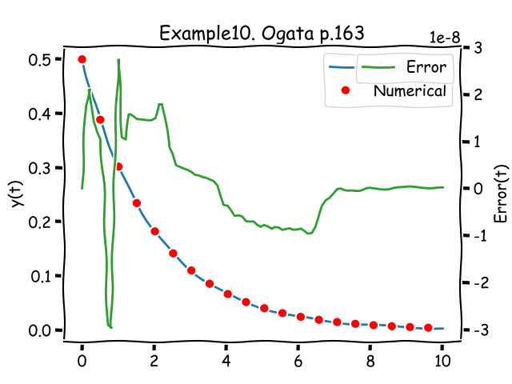
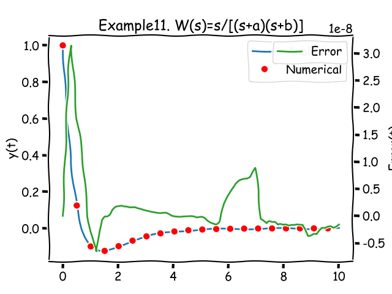
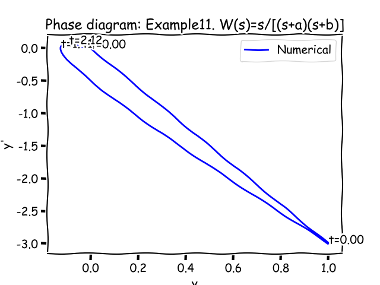
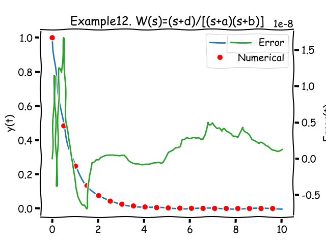
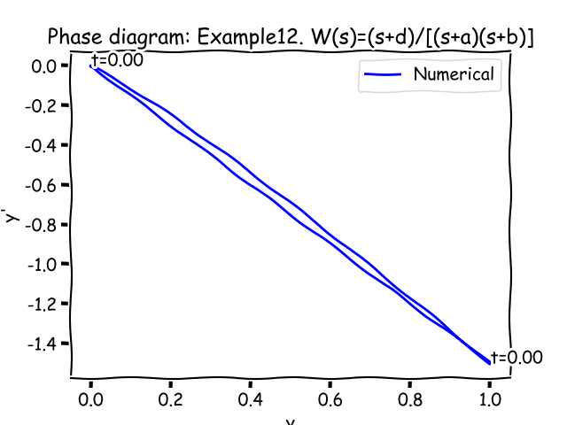
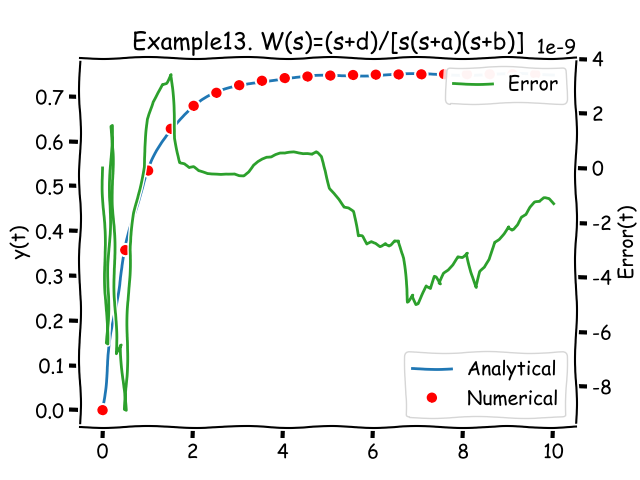
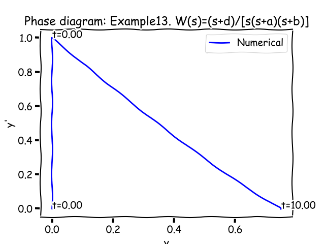
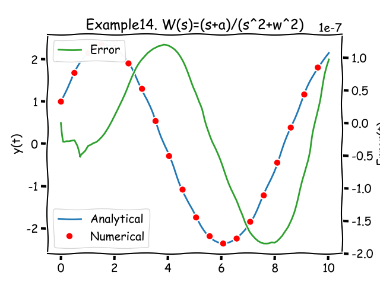
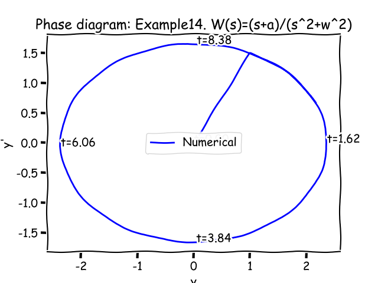

### 6. Verification of Type 1 by Examples

We now verify the main result (5.5) of Section 5 using the examples collected in Appendix B. The first example illustrates a first‑order system (Type 0a), while the remaining examples are of Type 1. To validate the method, we have developed a set of Python scripts that perform the calculations and generate the corresponding plots.

#### 6.1 Example 10 [Ogata, p. 163]

Consider the transfer function
$
C(s) = \frac{1}{Ts + 1}.
$

The impulse response corresponds to the system
$
\begin{cases}
T y' + y = \delta(t), \\
y(0) = 0
\end{cases}
\;\Longrightarrow\;
g(t) = \operatorname{IVP}(\{T, 1\}, \delta(t), t_0 = 0, \mathbf{y}_0 = \{0\}).
$
From Appendix B, the analytical solution (impulse response) is
$
g(t) = \frac{1}{T}\, e^{-t/T}.
$
For $T = 2$, we compare the numerical solution of the homogeneous system with modified initial condition against this analytical solution. The script `example10.py` produces the following plot:

  

#### 6.2 Example 11 [Xue, p. 380]

Transfer function:
$
TF = \frac{s}{(s+a)(s+b)} = \frac{s}{s^2 + (a+b)s + ab}.
$
The impulse response is the solution of
$
\begin{cases}
y'' + (a+b)y' + ab\,y = \delta'(t), \\
y(0) = y'(0) = 0
\end{cases}
\;\Longrightarrow\;
g(t) = \operatorname{IVP}(\{1, (a+b), ab\}, \{1, 0\}, t_0 = 0, \mathbf{y}_0 = \{0,0\}).
$
Analytical solution (Appendix B):
$
g(t) = \mathcal{L}^{-1}\!\left\{\frac{s}{(s+a)(s+b)}\right\}
      = \frac{1}{a-b}\bigl[ a e^{-a t} - b e^{-b t} \bigr].
$
We test the case $a = 1$, $b = 2$. The numerical solution, analytical solution, and error from `example11.py` are shown below:

  
  

#### 6.3 Example 12 [Xue, p. 380]

Transfer function:
$
TF = \frac{s+d}{(s+a)(s+b)} = \frac{s+d}{s^2 + (a+b)s + ab}.
$
Impulse response system:
$
\begin{cases}
y'' + (a+b)y' + ab\,y = \delta'(t) + d\,\delta(t), \\
y(0) = y'(0) = 0
\end{cases}
\;\Longrightarrow\;
g(t) = \operatorname{IVP}(\{1, (a+b), ab\}, \{1, d\}, t_0 = 0, \mathbf{y}_0 = \{0,0\}).
$
Analytical solution:
$
g(t) = \mathcal{L}^{-1}\!\left\{\frac{s+d}{(s+a)(s+b)}\right\}
      = \frac{1}{b-a}\bigl[ (d-a)e^{-a t} - (d-b)e^{-b t} \bigr].
$

For $a = 1$, $b = 2$, $d = 1.5$, the script `example12.py` yields:

  
  

#### 6.4 Example 13 [Xue, p. 380]

Transfer function:
$
TF = \frac{s+d}{s(s+a)(s+b)} = \frac{s+d}{s^3 + (a+b)s^2 + ab\,s}.
$
Impulse response system:
$
\begin{cases}
y''' + (a+b)y'' + ab\,y' = \delta'(t) + d\,\delta(t), \\
y(0) = y'(0) = y''(0) = 0
\end{cases}
\;\Longrightarrow\;
g(t) = \operatorname{IVP}(\{1, (a+b), ab, 0\}, \{1, d\}, t_0 = 0, \mathbf{y}_0 = \{0,0,0\}).
$
Analytical solution:
$
g(t) = \mathcal{L}^{-1}\!\left\{\frac{s+d}{s(s+a)(s+b)}\right\}
      = \frac{1}{ab}\left[ d - \frac{b(d-a)}{b-a}e^{-a t} + \frac{a(d-b)}{b-a}e^{-b t} \right].
$
For $a = 1$, $b = 2$, $d = 1.5$, the script `example13.py` produces:

  
  

#### 6.5 Example 14 [Xue, p. 380]

Transfer function:
$
TF = \frac{s+a}{s^2 + \omega^2}.
$
Impulse response system:
$
\begin{cases}
y'' + \omega^2 y = \delta'(t) + a\,\delta(t), \\
y(0) = y'(0) = 0
\end{cases}
\;\Longrightarrow\;
g(t) = \operatorname{IVP}(\{1, 0, \omega^2\}, \{1, a\}, t_0 = 0, \mathbf{y}_0 = \{0,0\}).
$
Analytical solution:
$
g(t) = \mathcal{L}^{-1}\!\left\{\frac{s+a}{s^2+\omega^2}\right\}
      = \frac{\sqrt{a^2+\omega^2}}{\omega}\, \sin\!\left(\omega t + \tan^{-1}\!\left(\frac{\omega}{a}\right)\right).
$

For $a = 1.5$, $\omega = 0.7$, the script `example14.py` gives:

  
  

