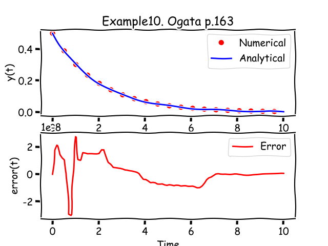
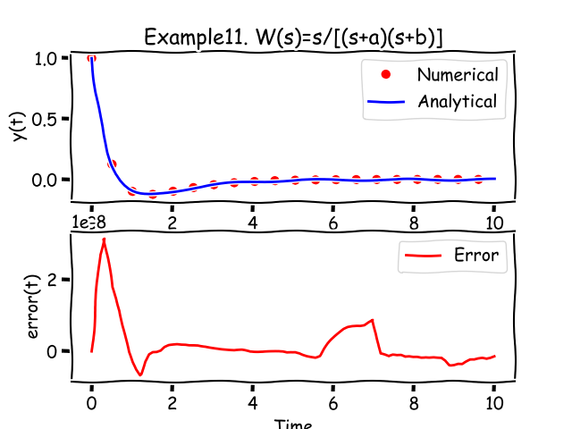

###6. Verification by examples for Type 1
Let's check the main result from previous chapter on examples Appendix B from. First example regarding first order system (Type0a), the reast are system Type1). To prove the method we've created number Python scripts performing the calculation and generating the charts with results.

#####6.1 Example10 [Ogata p.163]
$$ C(s)=\frac{1}{Ts+1} $$
Impulse function for this transfer function corresponds to this system:
$$
\begin{cases}
Ty'+y=\delta(t),\\
y(0)=0
\end{cases}
\Rightarrow 
g(t)=IVP(\{T\text{, }1\}, \delta(t), t_0=0,y_0=\{0\})
$$

Analitycal solution (impulse response) taken from Appendix B:
$$g(t)=\frac{1}{T}e^{-t/T}$$
Numerical solution, analytical solutions and error provided by Python's script (example10.py):

#####6.2 Example11 [Xue p.380]
$$
TF = \frac{s}{(s+a)(s+b)}=\frac{s}{s^2+(a+b)s+ab}
$$

Impulse function for this transfer function corresponds to this system:
$$
\begin{cases}
y''+(a+b)y'+ab\cdot y=\delta'(t)+0\cdot\delta(t),\\
y(0)=y'(0)=0
\end{cases}
\Rightarrow 
g(t)=IVP(\{1\text{, }(a+b)\text{, }ab\}, \{1\text{, }0\}, t_0=0,y_0=\{0\text{, }0\})
$$

Analitycal solution (impulse response) taken from Appendix B:
$$g(t)=L^{-1}\left\{\frac{s}{(s+a)(s+b)}\right\}=\frac{1}{a-b}\left[ae^{-at}-be^{-bt}\right]$$
Numerical solution, analytical solutions and error provided by Python's script (example11.py):

#####6.3 Example12 [Xue p.380]
$$
TF = \frac{s+d}{(s+a)(s+b)}=\frac{s+d}{s^2+(a+b)s+ab}
$$

Impulse function for this transfer function corresponds to this system:
$$
\begin{cases}
y''+(a+b)y'+ab\cdot y=\delta'(t)+d\cdot\delta(t),\\
y(0)=y'(0)=0
\end{cases}
\Rightarrow 
g(t)=IVP(\{1\text{, }(a+b)\text{, }ab\}, \{1\text{, }d\}, t_0=0,y_0=\{0\text{, }0\})
$$

Analitycal solution (impulse response) taken from Appendix B:
$$g(t)=L^{-1}\left\{\frac{s+d}{(s+a)(s+b)}\right\}=\frac{1}{b-a}\left[(d-a)e^{-at}-(d-b)e^{-bt}\right]$$
Numerical solution, analytical solutions and error provided by Python's script (example12.py):

#####6.4 Example13 [Xue p.380]
$$
TF = \frac{s+d}{s(s+a)(s+b)}=\frac{s+d}{s^3+(a+b)s^2+ab\cdot s}
$$

Impulse function for this transfer function corresponds to this system:
$$
\begin{cases}
y'''+(a+b)y''+ab\cdot y'=\delta'(t)+d\cdot\delta(t),\\
y(0)=y'(0)=y''(0)=0
\end{cases}
\Rightarrow 
g(t)=IVP(\{1\text{, }(a+b)\text{, }ab\text{, }0\}, \{1\text{, }d\}, t_0=0,y_0=\{0\text{, }0\text{, }0\})
$$

Analitycal solution (impulse response) taken from Appendix B:
$$g(t)=L^{-1}\left\{\frac{s+d}{s(s+a)(s+b)}\right\}=\frac{1}{ab}\left[d-\frac{b(d-a)}{b-a}e^{-at}+\frac{a(d-b)}{b-a}e^{-bt}\right]$$
Numerical solution, analytical solutions and error provided by Python's script (example12.py):

#####6.5 Example14 [Xue p.380]
$$
TF = \frac{s+a}{s^2+\omega^2}
$$

Impulse function for this transfer function corresponds to this system:
$$
\begin{cases}
y''+0\cdot y'+\omega^2\cdot y=\delta'(t)+a\cdot\delta(t),\\
y(0)=y'(0)=0
\end{cases}
\Rightarrow 
g(t)=IVP(\{1\text{, }0\text{, }\omega^2\}, \{1\text{, }a\}, t_0=0,y_0=\{0\text{, }0\})
$$

Analitycal solution (impulse response) taken from Appendix B:
$$g(t)=L^{-1}\left\{\frac{s+a}{s^2+\omega^2}\right\}=\frac{\sqrt{a^2+\omega^2}}{\omega}sin(\omega t+tan^{-1}(\frac{\omega}{a}))$$
Numerical solution, analytical solutions and error provided by Python's script (example14.py):

