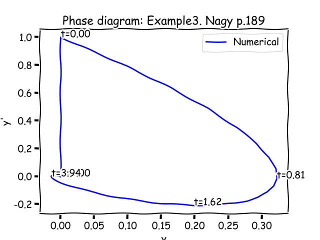
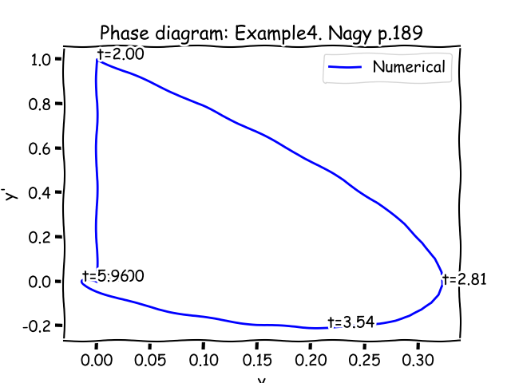

###3. Verification by examples
Let's check the main result from previous chapter on examples Appendix B from.
#####3.1 Example1 [Ogata, p.190]
Considering the following first order ODE
$$\begin{cases}
Ty'+y=\delta(t),\\
y(0)=0
\end{cases}\Rightarrow IVP(\{T\text{ }1\}, \mathbf{0}, t_0=0,y_0=0)\Rightarrow [A]=T,\{y\}_0=y(0),\{d\}=\{1\} \Rightarrow\\
\{z\}_0=\{y\}_0+[A]^{-1}\{d\}=\{y\}_0+1/T \Rightarrow$$
These 2 folloing system are equal by solution
$$\begin{cases}
Ty'+y=\delta(t),\\
y(0)=0
\end{cases}\equiv\begin{cases}
Tz'+z=0,\\
z(0)=1/T
\end{cases}
$$
In short form:
$$
IVP(\{T\text{ }1\}, \delta(t), t_0=0,y_0=0)\equiv 
IVP(\{T\text{ }1\}, 0, t_0=0,y_0=1/T)
$$
Which exactely the same as we mentioned before at Introduction (2.6)
Let's check how to correspond the numerical solution for T=2 for homogenous sytem with non-null IC with analitical solution for the system
$$
\begin{cases}
2y'+y=\delta(t),\\
y(0)=0
\end{cases}
$$
Numerical solution:

Analitycal solution:
$$y(t)=\frac{1}{T}e^{-t/T}=\frac{1}{2}e^{-t/2}$$

Error (Numerical solution minus Analitycal solution):

#####3.2 Example2 [Finan, pp.57-58]
Considering the following second order ODE
$${\begin{cases}
2y''+4y'+10y=\delta(t)\\
y_0=y(0)=0\\
y_1=y'(0)=0
\end{cases}}\Rightarrow
IVP(\{2\text{, }4\text{, }10\}, \delta(t), t_0=0,y_0=\{0\text{, }0\})\Rightarrow\\
A=\left[
    \begin{matrix}
    2 & 0 \\
    4 & 2 \\
    \end{matrix}\right]\text{, }
\{d\}=\left\{
    \begin{matrix}
    0 \\
    1 \\
    \end{matrix}\right\}\Rightarrow\\
A^{-1}=\left[
    \begin{matrix}
    1/2 & 0 \\
    -1 & 1/2 \\
    \end{matrix}\right]\text{, }
A^{-1}\{d\}=\left\{
    \begin{matrix}
    0 \\
    1/2 \\
    \end{matrix}\right\}
\Rightarrow\\
\{z\}_0=\{y\}_0+[A]^{-1}\{d\}=\left\{
    \begin{matrix}
    0 \\
    1/2 \\
    \end{matrix}\right\}$$
These 2 folloing system are equal by solution
$${\begin{cases}
2y''+4y'+10y=\delta(t)\\
y_0=y(0)=0\\
y_1=y'(0)=0
\end{cases}}\equiv{\begin{cases}
2z''+4z'+10z=0\\
z_0=z(0)=0\\
z_1=z'(0)=1/2
\end{cases}}
$$
In short form:
$$
IVP(\{2\text{, }4\text{, }10\}, \delta(t), t_0=0,y_0=\{0\text{, }0\})\equiv 
IVP(\{2\text{, }4\text{, }10\}, 0, t_0=0,y_0=\{0\text{, }1/2\})
$$
Numerical solution:

Phase plate:

Analitycal solution:
$$y(t)=\frac{1}{4}e^{-t}sin(2t)$$
Error (Numerical solution minus Analitycal solution):

#####3.3 Example3 [Nagy, p.189]
Considering the following second order ODE
$${\begin{cases}
y''+2y'+2y=\delta(t)\\
y_0=y(0)=0\\
y_1=y'(0)=0
\end{cases}}\Rightarrow
IVP(\{1\text{, }2\text{, }2\}, \delta(t), t_0=0,y_0=\{0\text{, }0\})\Rightarrow\\
A=\left[
    \begin{matrix}
    1 & 0 \\
    2 & 1 \\
    \end{matrix}\right]\text{, }
\{d\}=\left\{
    \begin{matrix}
    0 \\
    1 \\
    \end{matrix}\right\}\Rightarrow\\
A^{-1}=\left[
    \begin{matrix}
    1 & 0 \\
    -2 & 1 \\
    \end{matrix}\right]\text{, }
A^{-1}\{d\}=\left\{
    \begin{matrix}
    0 \\
    1\\
    \end{matrix}\right\}
\Rightarrow\\
\{z\}_0=\{y\}_0+[A]^{-1}\{d\}=\left\{
    \begin{matrix}
    0 \\
    1 \\
    \end{matrix}\right\}$$
These 2 folloing system are equal by solution:
$$
{\begin{cases}
y''+2y'+2y=\delta(t)\\
y_0=y(0)=0\\
y_1=y'(0)=0
\end{cases}}\Rightarrow
{\begin{cases}
z''+2z'+2z=\delta(t)\\
z_0=z(0)=0\\
z_1=z'(0)=1
\end{cases}}
$$
In short form:
$$
IVP(\{1\text{, }2\text{, }2\}, \delta(t), t_0=0,y_0=\{0\text{, }0\})\equiv 
IVP(\{1\text{, }2\text{, }2\}, 0, t_0=0,y_0=\{0\text{, }1\})
$$
Numerical solution:

Phase plate:

Error (Numerical solution minus Analitycal solution):

#####3.4 Example4 [Nagy, p.189]
Considering the following second order time invariant ODE
$$
\begin{cases}
y''+2y'+2y=\delta(t-c)\\
y(0)=y'(0)=0\\
c=2
\end{cases}
$$
This system could be separated on two systems, moreover the IC for a second system based on results first one:
$$
\begin{cases}
y1''+2y1'+2y1=0\\
y1(0)=0\\
y1'(0)=0\\
0\le t \le c
\end{cases}
$$
$$
\begin{cases}
y2''+2y2'+2y2=\delta(t-c)\\
y2(c)=y1(c)\\
y2'(c)=y1'(c)\\
t \ge c
\end{cases}
$$
So, the solution of the original system is:
$$
y(t) =
\begin{cases}
y1(t),  & \text{if $0\le t \le c$} \\
y2(t), & \text{if $t \ge c$}
\end{cases}
$$
Numerical solution:

Phase plate:

#####3.5 Example5 [Zill, p.293]
Considering the following second order ODE
$$
\begin{cases}
y''+y=4\delta(t-2\pi),\\
y_0=y(0)=0\\
y_1=y'(0)=0
\end{cases}
$$
This system could be separated on two systems, moreover the IC for a second system based on results first one:
$$
\begin{cases}
y1''+y1=0,\\
y1_0=y1(0)=0\\
y1_1=y1'(0)=0\\
0\le t \le 2\pi
\end{cases}
$$
$$
\begin{cases}
y2''+y2=4\delta(t-2\pi),\\
y2(2\pi)=y1(2\pi)\\
y2'(2\pi)=y1'(2\pi)\\
t \ge 2\pi
\end{cases}
$$
Numerical solution:

Phase plate:

#####3.6 Example6 [Zill, p.293]
Considering the following second order ODE
$$
\begin{cases}
y''+y=4\delta(t-2\pi),\\
y_0=y(0)=1\\
y_1=y'(0)=0
\end{cases}
$$
This system could be separated on two systems, moreover the IC for a second system based on results first one:
$$
\begin{cases}
y1''+y1=0,\\
y1_0=y1(0)=1\\
y1_1=y1'(0)=0\\
0\le t \le 2\pi
\end{cases}
$$
$$
\begin{cases}
y2''+y2=4\delta(t-2\pi),\\
y2(2\pi)=y1(2\pi)\\
y2'(2\pi)=y1'(2\pi)\\
t \ge 2\pi
\end{cases}
$$
Numerical solution:

Phase plate:

qwe
qwe
qwe
qwe
qwe

